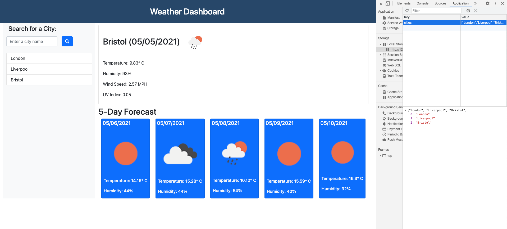

# Weather Dashboard

- [Weather Dashboard](#weather-dashboard)
  - [Description](#description)
  - [Technologies used](#technologies-used)
  - [Future improvements](#future-improvements)
  - [Screenshots](#screenshots)
  - [Github](#github)
    - [Github repository: https://github.com/vilmaq/weather-app](#github-repository-httpsgithubcomvilmaqweather-app)
    - [Github Site URL: https://vilmaq.github.io/weather-app/](#github-site-url-httpsvilmaqgithubioweather-app)

## Description

Following what the application does, explained in steps:

1.  Searches for a city and adds it in the list of the searched cities below the search button
2.  Stores the searched city in the Local Storage and displays the list of cities stores in the LS
3.  Loads asynchronously the weather results for the current day and for the last 5 days for a searched city.

## Technologies used

Javascript, HTML, Bootstrap,openweathermap API

## Future improvements

1. Get the cities as suggestions when typing the first 2 characters by using another API that loads cities
2. Error handling, when a "bad" input is entered in the searched city

## Screenshots

The following image shows the Weather Dashboard and in the right the Local Storage with the searched cities in it

## Github

### Github repository: https://github.com/vilmaq/weather-app

### Github Site URL: https://vilmaq.github.io/weather-app/
